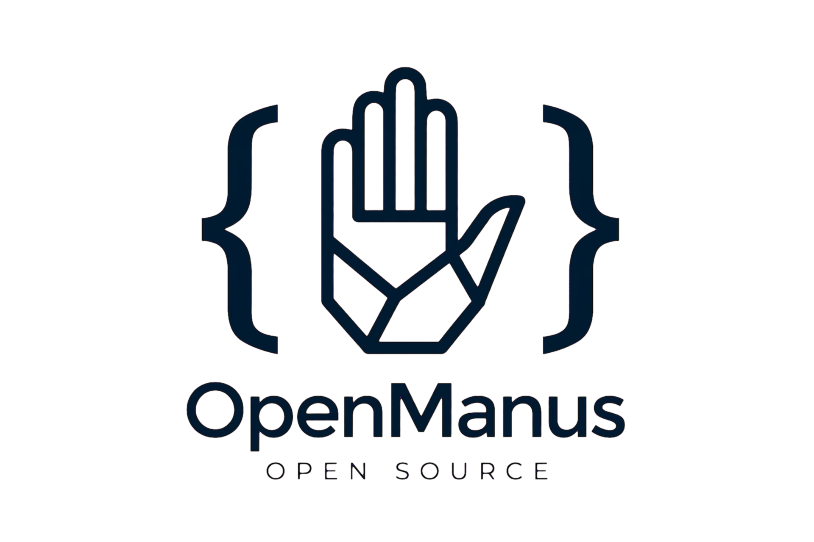

<div align="center">

  

  # OpenManus

  **O Agente Autônomo de Inteligência Artificial Aberto & Extensível**

  [](https://nextjs.org/)
  [](https://www.typescriptlang.org/)
  [](https://tailwindcss.com/)
  [](https://e2b.dev/)
  [](LICENSE)

  <p align="center">
    O <strong>OpenManus</strong> é uma plataforma moderna e completa de agente autônomo com suporte a múltiplos modelos de linguagem (Gemini, Claude, GPT-4o, DeepSeek, Ollama e mais), execução real em sandbox isolado com E2B, pesquisa web e automação contínua.
  </p>

</div>

---

## 🌟 Principais Recursos

- 🤖 **Múltiplos Provedores de IA**: Suporte e alternância dinâmica entre modelos de ponta como Google Gemini 2.5/3.7, Claude 3.5 Sonnet, GPT-4o, DeepSeek-R1 e modelos locais via Ollama.
- ⚡ **Execução em Sandbox E2B**: Ambiente seguro e isolado na nuvem para executar comandos bash, scripts Python, testes de APIs e inspeção de código em tempo real.
- 🌐 **Navegação & Pesquisa Web Autônoma**: Inspeção de páginas, extração de dados e síntese inteligente de conteúdo online com navegador integrado.
- ⏱️ **Tarefas Agendadas (Cron)**: Crie fluxos de trabalho que o OpenManus executa de forma autônoma e periódica no horário programado.
- 🧩 **Ecossistema de Conectores & Plugins**: Conexão com GitHub, Google Workspace, PostgreSQL, Figma, Docker, Slack e APIs personalizadas.
- 🎨 **Interface Focada & Responsiva**: Design refinado, tema claro sofisticado, painel dividido (split-view) com terminal e navegador interativo.
- 💾 **Persistência Local e Segura**: Histórico de conversas gerenciado localmente sem dependência de dados mockados.

---

## 🛠️ Tecnologias Utilizadas

- **Framework**: [Next.js](https://nextjs.org/) (App Router)
- **Linguagem**: [TypeScript](https://www.typescriptlang.org/)
- **Estilização**: [Tailwind CSS v4](https://tailwindcss.com/)
- **Ícones**: [Lucide React](https://lucide.dev/)
- **Animações**: [Motion / Framer Motion](https://motion.dev/)
- **Gráficos & Métricas**: [Recharts](https://recharts.org/)
- **Sandbox em Nuvem**: [E2B Code Interpreter](https://e2b.dev/)

---

## 🚀 Como Começar

### 1. Pré-requisitos
- **Node.js** 18+ ou **Bun**
- Chave de API do provedor de IA desejado (por exemplo, `GEMINI_API_KEY`)
- *(Opcional)* Chave de API do [E2B](https://e2b.dev/) para execução de código em sandbox

### 2. Instalação

```bash
# Clone o repositório
git clone https://github.com/your-username/openmanus.git

# Acesse o diretório
cd openmanus

# Instale as dependências
npm install
```

### 3. Configuração de Variáveis de Ambiente

Crie um arquivo `.env.local` na raiz do projeto com base no `.env.example`:

```env
GEMINI_API_KEY=seu_token_aqui
```

### 4. Executando o Projeto

```bash
# Inicie o servidor de desenvolvimento
npm run dev
```

Acesse [http://localhost:3000](http://localhost:3000) no seu navegador.

---

## 💡 Como Usar

1. **Inicie uma Tarefa**: Digite seu comando ou objetivo no campo de entrada no centro do workspace (ex.: *"Crie um aplicativo de finanças interativo"* ou *"Execute um script Python para auditar dados"*).
2. **Acompanhe o Raciocínio**: Visualize os passos planejados pelo agente, chamadas de ferramentas e saídas de terminal em tempo real.
3. **Painel Sandbox**: Clique no botão do painel à direita para alternar entre a visualização de navegador web e terminal de comando interativo.
4. **Gerenciador de Modelos**: Acesse as configurações no topo ou na barra lateral para trocar de modelo ou configurar endpoints locais (Ollama / LocalAI).

---

## 📄 Licença

Distribuído sob a licença **MIT**. Consulte o arquivo de licença para mais detalhes.
